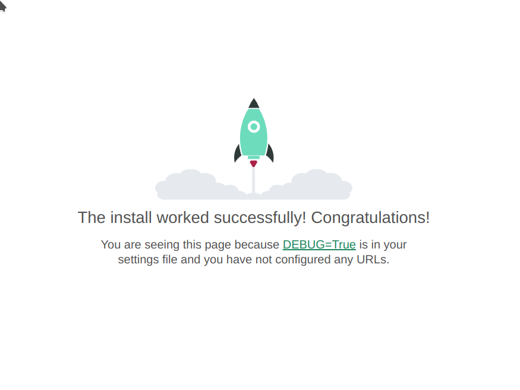
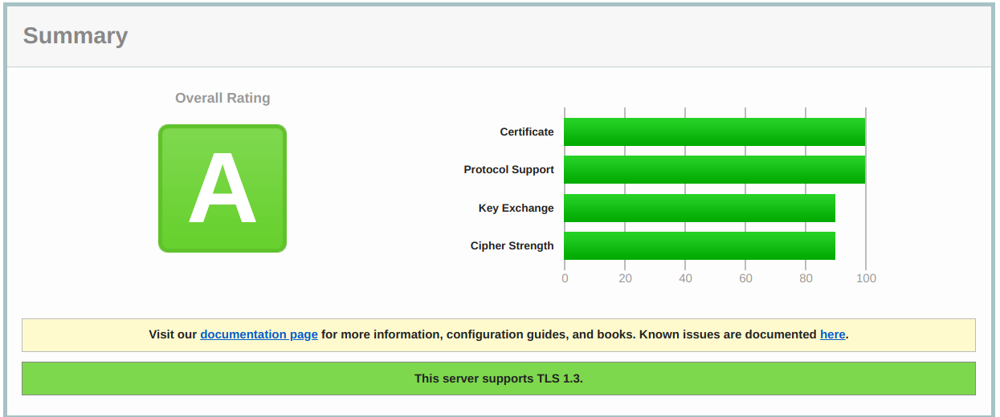

# [Video tutorial(RUS) ](https://youtu.be/9VYB58u664A)
# deploy-django-app-postgresql-docker


Demo project to deploy to bare metal server (or any system) using docker, docker-compose and certbot to automatically and for free obtain ssl certificate.


# Todo

1. Create docker-compose.yaml
1. Create templates for all the services

## Create Django-service
1. Navigate or create your pjoject's folder
    ```bash
    mkdir deploy-test
    cd deploy-test
    ```
1. init git repo (if not clonned)
    ```bash
    git init
    ```
1. create `.gitignore` file (if not clonned)
    ```bash
    vim .gitignore # or any other text editor your want
    ```
  [suggested .gitignore content from GitHub](https://raw.githubusercontent.com/github/gitignore/master/Python.gitignore)
1. Create `django-backend` folder for related service
    ```bash
    mkdir django-backend
    cd django-backend
    ```
1. Create the following `Dockerfile` in `django-backend` folder
    ```Dockerfile
    # Dockerfile
    FROM python:3.9
    WORKDIR /app
    RUN apt-get update -y
    RUN apt-get upgrade -y
    COPY ./requirements.txt ./
    RUN pip install --upgrade pip
    RUN pip install -r requirements.txt
    COPY ./src ./src
    CMD gunicorn -w 3 --chdir ./src proj.wsgi --bind 0.0.0.0:8000
    ```
1. Create virtual env in `django-backend`
    ```bash
    python3 -m venv env  # create env
    . ./env/bin/activate # activate env
    ```
1. Start new django project in `django-backend` folder
    ```bash
    pip install -U Django # install or update Django
    pip install -U gunicorn # install Gunicorn webserver
    django-admin startproject proj # create new django project
    mv ./proj ./src # rename outer proj folder to src (just for convenience)
    ```
1. Create `requirements.txt` in `django-backend` folder
    ```bash
    pip freeze > ./requirements.txt
    ```
1. Create the following `docker-compose.yml` file in the project's folder (next to `django-backend` folder)
    ```bash
    cd .. # cd 1 level up to project's folder
    vim docker-compose.yml # or any other text editor your want
    # content of the file is below
    ```
    ```yaml
    version: "3.9"

    services: 
      django-backend:
        restart: always
        build:
          context: ./django-backend # django service folder
        image: djangobackend# name the resulted image: https://docs.docker.com/compose/compose-file/compose-file-v3/#build
    # ...
    ```
1. Try to run the service

    ```bash
    # in project's root folder
    docker-compose up
    ```
    
    ```bash
    django-backend_1  | [2021-08-30 08:30:20 +0000] [7] [INFO] Starting gunicorn 20.1.0
    django-backend_1  | [2021-08-30 08:30:20 +0000] [7] [INFO] Listening at: http://0.0.0.0:8000 (7)
    django-backend_1  | [2021-08-30 08:30:20 +0000] [7] [INFO] Using worker: sync
    django-backend_1  | [2021-08-30 08:30:20 +0000] [8] [INFO] Booting worker with pid: 8
    django-backend_1  | [2021-08-30 08:30:20 +0000] [9] [INFO] Booting worker with pid: 9
    django-backend_1  | [2021-08-30 08:30:20 +0000] [10] [INFO] Booting worker with pid: 10
    ```
## Create DB-service

1. Adjust `docker-compose.yml` file
    ```bash
    vim docker-compose.yml # or any other text editor your want
    # content of the section is below
    ```
    ```yaml
    services:
    # ... previous section
    # ... add this section below
      postgresql-db:
        restart: always
        image: postgres
        env_file: ./postgresql-db/.pg-env # why - see the next step
    ```
1. add `.pg-env` and `persistentdata/*` to `.gitignore` - very important! Security issue could arise if not done. This file MUST NOT be in a git repository
    ```bash
    vim .gitignore # or any other text editor your want
    # add .pg-env to the file
    ```
1. Create `postgresql-db` folder in project's root
    ```bash
    mkdir postgresql-db
    cd postgresql-db # and cd into it
    ```
1. Create `.pg-env`
    ```bash
    vim .pg-env # or any other text editor your want
    ```
    ```bash
    # adjust names and passwords to your real passwords and names

    POSTGRES_USER=deploy-test-user
    POSTGRES_PASSWORD=your-deploy-test-password
    POSTGRES_DB=deploy-db
    ```
1. Add `psycopg2-binary` to django requirements
    ```bash
    cd ../django-backend # cd to django-backend
    pip install -U psycopg2-binary
    pip freeze > ./requirements.txt
    ```
1. Add `locals_vars.py` to `.gitignore` - very important! Security issue could arise if not done. This file MUST NOT be in a git repository
1. Create `locals_vars.py` inside your django project next to `settings.py` file
    ```bash
    vim ./src/proj/locals_vars.py # or any other text editor your want
    ```
    ```python
    # locals_vars.py
    SECRET_KEY = 'django-insecure-wa#75l@ub0+vr1_q^(34nvew(-6$v&lk^vhgbxj5#1z7+q+%65'
    PG_NAME = 'deploy-db' # as a POSTGRES_DB in .pg-env
    PG_USER = 'deploy-test-user' # as in  POSTGRES_USER in .pg-env
    PG_PASSWORD = 'your-deploy-test-password' # as a POSTGRES_PASSWORD  in .pg-env
    PG_HOST = 'postgresql-db' # as the DB's service name in docker-compose.yml
    ```
1. Ajust django `settings.py` to use db-service as following:
    ```bash
    vim ./src/proj/settings.py # or any other text editor your want
    ```
    ```python
    # settings.py
    
    # somewhere at top
    from . import locals_vars # should in .gitignore
    # replace the original line SECRET_KEY = ...
    SECRET_KEY = locals_vars.SECRET_KEY
    # edit the following block
    # exposing your passwords to github is not a good idea! Use import and gitignore
    DATABASES = {
        'default': {
            'ENGINE': 'django.db.backends.postgresql_psycopg2',
            'NAME': locals_vars.PG_NAME,
            'USER': locals_vars.PG_USER,
            'PASSWORD': locals_vars.PG_PASSWORD,
            'HOST': locals_vars.PG_HOST,
            'PORT': '', # default
        }
    }
    ```
1. Try to run both services:
    ```bash
    docker-compose up --build
    ```
    ```bash
    postgresql-db_1   | PostgreSQL init process complete; ready for start up.
    postgresql-db_1   | 
    postgresql-db_1   | 2021-08-30 10:38:43.954 UTC [1] LOG:  starting PostgreSQL 13.2 (Debian 13.2-1.pgdg100+1) on x86_64-pc-linux-gnu, compiled by gcc (Debian 8.3.0-6) 8.3.0, 64-bit
    postgresql-db_1   | 2021-08-30 10:38:43.954 UTC [1] LOG:  listening on IPv4 address "0.0.0.0", port 5432
    postgresql-db_1   | 2021-08-30 10:38:43.954 UTC [1] LOG:  listening on IPv6 address "::", port 5432
    postgresql-db_1   | 2021-08-30 10:38:43.956 UTC [1] LOG:  listening on Unix socket "/var/run/postgresql/.s.PGSQL.5432"
    postgresql-db_1   | 2021-08-30 10:38:43.959 UTC [75] LOG:  database system was shut down at 2021-08-30 10:38:43 UTC
    postgresql-db_1   | 2021-08-30 10:38:43.962 UTC [1] LOG:  database system is ready to accept connections
    ```
1.  try to migrate: connect to django container and run:
    while the contaners are running, connect from other terminal window
    ```bash
    docker-compose exec django-backend bash
    # inside running docker container
    cd src/
    python manage.py migrate
    ```
    ```bash
    Operations to perform:
    Apply all migrations: admin, auth, contenttypes, sessions
    Running migrations:
    Applying contenttypes.0001_initial... OK
    Applying auth.0001_initial... OK
    Applying admin.0001_initial... OK
    Applying admin.0002_logentry_remove_auto_add... OK
    Applying admin.0003_logentry_add_action_flag_choices... OK
    Applying contenttypes.0002_remove_content_type_name... OK
    Applying auth.0002_alter_permission_name_max_length... OK
    Applying auth.0003_alter_user_email_max_length... OK
    Applying auth.0004_alter_user_username_opts... OK
    Applying auth.0005_alter_user_last_login_null... OK
    Applying auth.0006_require_contenttypes_0002... OK
    Applying auth.0007_alter_validators_add_error_messages... OK
    Applying auth.0008_alter_user_username_max_length... OK
    Applying auth.0009_alter_user_last_name_max_length... OK
    Applying auth.0010_alter_group_name_max_length... OK
    Applying auth.0011_update_proxy_permissions... OK
    Applying auth.0012_alter_user_first_name_max_length... OK
    Applying sessions.0001_initial... OK
    ```

## Create NGINX-service

1. Create folder `nginx`
    ```bash
    mkdir nginx
    cd nginx
    ```
1. Create `Dockerfile` in it
    ```bash
    vim Dockerfile # or any other text editor your want
    ```
    ```docker
    FROM nginx
    # next line copies nginx configuration to the proxy-server
    COPY ./default.conf /etc/nginx/conf.d/default.conf 
    ```
1. Create `default.conf` with `nginx` configurarion
    ```bash
    vim default.conf # or any other text editor your want
    ```
    ```nginx
    upstream innerdjango {
        server django-backend:8000;
        # connection to the inner django-backend service
        # here `django-backend` is the service's name in
        # docker-compose.yml, it is resolved by docker to inner IP address.
        # The `innerdjango` is just te name of upstream, used by nginx below. 
    }
    server {
        # the connection to the outside world
        # will be changed to incorporate cert's bot and ssl
        # just to test it localy for now
        listen 80; # port exposed to outside world. Needs to be opened in docker-compose.yml
        # server_name example.com;
        location / {
            # where to redirect `/` requests
            # to inner `innerdjango` upstream
            proxy_pass http://innerdjango;
        }
    }
    ```
1. Add `nginx` service to `docker-compose.yml`
    ```bash
    cd .. # cd to project root
    vim docker-compose.yml # or any other text editor your want
    ```
    ```yml
    services: 

    nginx:
        restart: always
        build:
            context: ./nginx
        ports:
        - "80:80" # port exposed to outside world.
    # .. other services
    ```
1. Test what's been done so far:
    
    1. Run docker-compose
        ```bash
        cd .. # cd to project root
        docker-compose up --build
        ```
    1. Navigate to [127.0.0.1](http://127.0.0.1) in your browser.
    You must see something like this
        ```
        Invalid HTTP_HOST header: 'innerdjango'. You may need to add 'innerdjango' to ALLOWED_HOSTS.
        ```
    It's ok for now.
    If you see it everything works...
1. comment in the string  `# server_name example.com;` and adjust the name to your domainname
    ```bash
    cd nginx/
    vim default.conf # or any other text editor your want
    ```
    ```nginx
    upstream innerdjango {
        server django-backend:8000;
        # connection to the inner django-backend service
        # here `django-backend` is the service's name in
        # docker-compose.yml, it is resolved by docker to inner IP address.
        # The `innerdjango` is just te name of upstream, used by nginx below. 
    }
    server {
        # the connection to outside world
        # will be changed to incorporate cert's bot and ssl
        # just to test it localy for now
        listen 80; # port exposed to outside world
        server_name django-deploy.tk; # <-- here adjust to YOUR domain name
        location / {
            # where to redirect `/` requests
            # to inner `innerdjango` upstream
            proxy_set_header X-Real-IP $remote_addr;
            proxy_set_header Host $host;
            proxy_pass http://innerdjango;
        }
    }
    ```
1. Adjust django setting.py to your domain
    ```bash
    cd .. # cd to project root
    vim ./django-backend/src/proj/settings.py # or any other text editor your want
    ```
    ```python
    DEBUG = True # for now to see the welcome page. If you set it to False it would be more production ) but you will get boring 404 error
    ALLOWED_HOSTS = ['django-deploy.tk'] # adjust to YOUR domain name here
    ```
1. Try to bring up your services
    ```bash
    # git clone your project to a host
    docker-compose up -build
    ```
1. Here Django almost running in production mode
    1. Persistent data storage must be added
    1. SSL certificate is needed


1. Open 443 port in `docker-compose.yml` for `nginx` service
    ```bash
    vim docker-compose.yml  # or any other text editor your want
    ```
    ```yaml
    services:

      nginx:
        restart: always
        build:
          context: ./nginx
        ports:
          - "80:80"
          - "443:443" # <--- add this line
    ```
1. add new service to `docker-compose.yml`
    ```yaml
    services:
    # .. previous configs...
      certbot:
        image: certbot/certbot
    ```

1. Create a folder fo persistent data (certs, statics, media etc.)
    ```bash
    mkdir persistentdata
    mkdir persistentdata/certbot
    mkdir persistentdata/certbot/conf
    mkdir persistentdata/certbot/www
    mkdir persistentdata/certbot/conf/live/
    mkdir persistentdata/certbot/conf/live/django-deploy.tk/ # adjust to your domain
    mkdir persistentdata/static
    mkdir persistentdata/media
    mkdir persistentdata/db
    ```
1. Share the volumes between `nginx` and `certbot` in order to allow to provite all the data for apropriate response for challenge. Add these lines to `docker-compose.yml`
    ```bash
    vim docker-compose.yml  # or any other text editor your want
    ```
    ```yaml
    # ...
    services:
      nginx:
        restart: always
        build:
          context: ./nginx
        ports:
          - "80:80"
          - "443:443"
        volumes:
          - ./persistentdata/certbot/conf:/etc/letsencrypt # <--here
          - ./persistentdata/certbot/www:/var/www/certbot # <--here
      certbot:
        image: certbot/certbot
        volumes:
          - ./persistentdata/certbot/conf:/etc/letsencrypt # <--here
          - ./persistentdata/certbot/www:/var/www/certbot # <--here
      # ...
    ```
1. Now we need to point our `nginx` to this location. In order to response to the challenge.
add `location /.well-known/acme-challenge/` section as below/
    ```bash
    vim ./nginx/default.conf  # or any other text editor your want
    ```
    ```nginx
    server {
        # the connection to the outside world
        # will be changed to incorporate cert's bot and ssl
        # just to test it localy for now
        listen 80; # port exposed to outside world. Needs to be opened in docker-compose.yml
        server_name django-deploy.tk;
        # server_name example.com;
        location / {
          # where to redirect `/` requests
          return 301 https://$host$request_uri; # redirect all non https requests to https
        }
        location /.well-known/acme-challenge/ { # <-- this section
            # let's encrypt asks for this location and needs to get the response from /var/www/certbot
            # generated by certbot and available to nginx via volumes
            root /var/www/certbot;
        }
    }
    ```
1. Start...
    ```bash
    docker-compose up --build
    ```
1. You will see an error:
    ```log
    certbot_1         | Certbot doesn't know how to automatically configure the web server on this system. However, it can still get a certificate for you. Please run "certbot certonly" to do so. You'll need to manually configure your web server to use the resulting certificate.
    ```
    It is ok for now. Let it keep runnind and open another terminal window
1. Request Let's encript for real cert: run the following and do not to forget to adjust domain name.
    in recently opened window, in project, root. run the following:
    ```bash
    docker-compose run --rm --entrypoint "\
    certbot certonly --webroot -w /var/www/certbot \
      --email denniskot@gmail.com \
      -d django-deploy.tk \
      --rsa-key-size 2048 \
      --agree-tos \
      --force-renewal" certbot
    ```
1. Edit `nginx` `default.conf`
    ```bash
    vim ./nginx/default.conf  # or any other text editor your want
    ```
    ```nginx
    upstream innerdjango {
        server django-backend:8000;
        # connection to the inner django-backend service
        # here `django-backend` is the service's name in
        # docker-compose.yml, it is resolved by docker to inner IP address.
        # The `innerdjango` is just te name of upstream, used by nginx below.
    }
    server {
        # the connection to outside world
        listen 80; # port exposed to the outside world
        server_name django-deploy.tk;
        location / {
            # rewrite this section
            # where to redirect `/` requests
            return 301 https://$host$request_uri; # redirect all non https requests to https
        }
    }
    server {
        # new server, but for ssl (443 port)
        listen 443 ssl; # listen 443 port
        server_name django-deploy.tk;
        location / {
            proxy_pass http://innerdjango; # pass these requests to internal upstream
            proxy_set_header X-Real-IP $remote_addr;
            proxy_set_header Host $host;
            proxy_set_header X-Forwarded-Proto https;
        }
    }
    ```
1. Add ssl-key pathes to nginx:
    ```bash
    vim ./nginx/default.conf  # or any other text editor your want
    ```
    ```nginx
    # add to this section
    server {
        # new server, but for ssl (443 port)
        listen 443 ssl; # listen 443 port
        server_name django-deploy.tk;
        # dont forget to adjust django-deploy.tk to your domain
        ssl_certificate /etc/letsencrypt/live/django-deploy.tk/fullchain.pem; # <-this
        ssl_certificate_key /etc/letsencrypt/live/django-deploy.tk/privkey.pem; # <-this
        location / {
            proxy_pass http://innerdjango; # pass these requests to internal upstream
            proxy_set_header X-Real-IP $remote_addr;
            proxy_set_header Host $host;
            proxy_set_header X-Forwarded-Proto https;
        }
    }
    ```
  
1. Add A+ recomended config to your nginx server
    ```bash
    wget https://raw.githubusercontent.com/certbot/certbot/master/certbot-nginx/certbot_nginx/_internal/tls_configs/options-ssl-nginx.conf # download file
    mv options-ssl-nginx.conf ./persistentdata/certbot/conf/ # move it
    wget https://raw.githubusercontent.com/certbot/certbot/master/certbot/certbot/ssl-dhparams.pem # download file
    mv options-ssl-nginx.conf ./persistentdata/certbot/conf/ # move it
    mv ssl-dhparams.pem ./persistentdata/certbot/conf/
    ```
1. Configure certbot to automaticaly renew certificate. Add entrypoint section to certbot
    ```bash
    vim docke-compose.yml  # or any other text editor your want
    ```
    ```yml
    certbot:
      image: certbot/certbot
      entrypoint: "/bin/sh -c 'trap exit TERM; while :; do certbot renew; sleep 12h & wait $${!}; done;'"
      volumes:
        - ./persistentdata/certbot/conf:/etc/letsencrypt
        - ./persistentdata/certbot/www:/var/www/certbot
    ```
1. Configure nginx to reload every 6 hours
    ```bash
    vim docker-compose.yml  # or any other text editor your want
    ```
    ```yml
    certbot:
      image: certbot/certbot
      entrypoint: "/bin/sh -c 'trap exit TERM; while :; do certbot renew; sleep 12h & wait $${!}; done;'"
      volumes:
        - ./persistentdata/certbot/conf:/etc/letsencrypt
        - ./persistentdata/certbot/www:/var/www/certbot
    ```
1.  Configure persistent storage data for postgreSQL DB - add volume section to db docker-compose
    ```yml
    postgresql-db:
      restart: always
    image: postgres
    volumes:
      - ./persistentdata/db:/var/lib/postgresql/data # <-- add this
    ```
1. Add SSL-related config to django 
    ```bash
    vim django-backend/src/proj/settings.py  # or any other text editor your want
    ```
    ```python
    SECURE_PROXY_SSL_HEADER = ('HTTP_X_FORWARDED_PROTO', 'https')
    SECURE_SSL_REDIRECT = True
    SESSION_COOKIE_SECURE = True
    CSRF_COOKIE_SECURE = True
    ```
1. Configure nginx to use static and media files
    ```bash
    vim docker-compose.yml  # or any other text editor your want
    ```
    ```yml
   nginx:
    restart: always
    build:
        context: ./nginx
    ports:
      - "80:80" # port exposed to outside world.
      - "443:443" # <--- add this line
    command: "/bin/sh -c 'while :; do sleep 6h & wait $${!}; nginx -s reload; done & nginx -g \"daemon off;\"'"
    volumes:
      - ./persistentdata/certbot/conf:/etc/letsencrypt 
      - ./persistentdata/certbot/www:/var/www/certbot
      - ./persistentdata/static:/var/www/static # <--here
      - ./persistentdata/media:/var/www/media # <--here
    ```
    ```bash
    vim ./nginx/default.conf  # or any other text editor your want
    ```
    ```nginx
    server {
      listen 443 ssl;
      # ... previous config
      location /static/ {
        root /var/www;
      }
      location /media/ {
          root /var/www;
      }
    }
    ```
1. Configure django to store static and media files in persistent way
    ```bash
    vim docker-compose.yml  # or any other text editor your want
    ```
    ```yml
    django-backend:
      restart: always
      build:
        context: ./django-backend
      image: djangobackend
      volumes:
        - ./persistentdata/static:/var/www/static # <--here
        - ./persistentdata/media:/var/www/media # <--here
1. Adjust django settings for static and media files
    ```bash
    vim django-backend/src/proj/settings.py  # or any other text editor your want
    ```
    ```python
    " add this lines
    STATIC_ROOT = '/var/www/static'
    MEDIA_URL = '/media/'
    MEDIA_ROOT = '/var/www/media'
    ```
1. Connect to running container and collect static. Make migrations.
    ```bash
    docker-compose up --build
    ```
    Let it run.

    Open another terminal
    ```bash
    docker-compose exec django-backend bash
    # inside container
    cd src/
    python manage.py collectstatic
    # you should see...
    # 128 static files copied to '/var/www/static'.
    python manage.py migrate # migrate db
    # you should see...
    # Operations to perform:
    #  Apply all migrations: admin, auth, contenttypes, sessions
    # Running migrations:
    #  Applying contenttypes.0001_initial... OK
    #  Applying auth.0001_initial... OK
    ```
1. Check if persistent data is in place
    ```bash
    # exit container if you are in it
    sudo ls persistentdata/db/
    # you shoul see

    # PG_VERSION    pg_dynshmem    pg_multixact  pg_snapshots  pg_tblspc    postgresql.auto.conf
    # base          pg_hba.conf    pg_notify     pg_stat       pg_twophase  postgresql.conf
    # global        pg_ident.conf  pg_replslot   pg_stat_tmp   pg_wal       postmaster.opts
    # pg_commit_ts  pg_logical     pg_serial     pg_subtrans   pg_xact      postmaster.pid
    sudo ls persistentdata/static/
    # you shoul see
    # admin
    ```
1. Try visit our site and login to admin panel
    ```bash
    docker-compose down
    docker-compose up --build -d # run in backgroun
    ```
  
# The results:
  - free domain
  - free cert
  - automatic



# Enjoy
